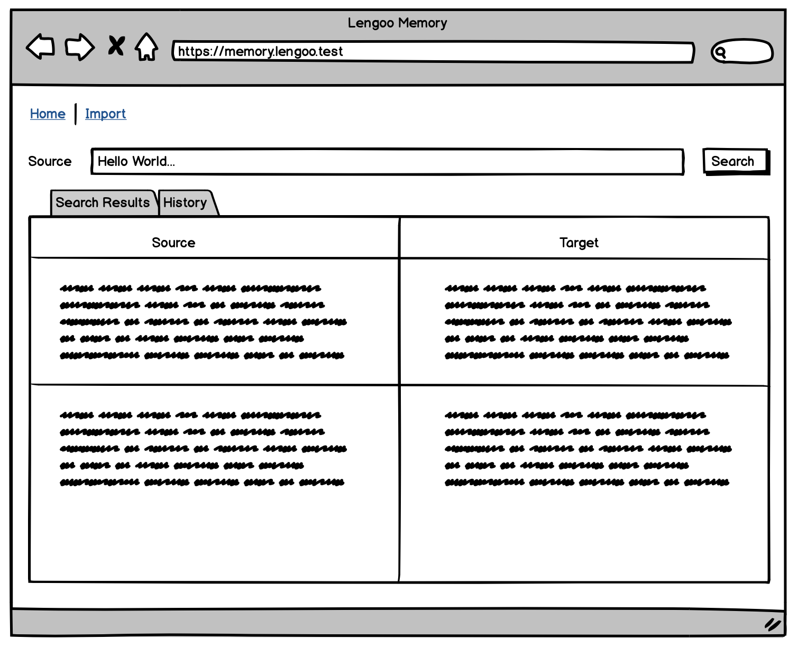
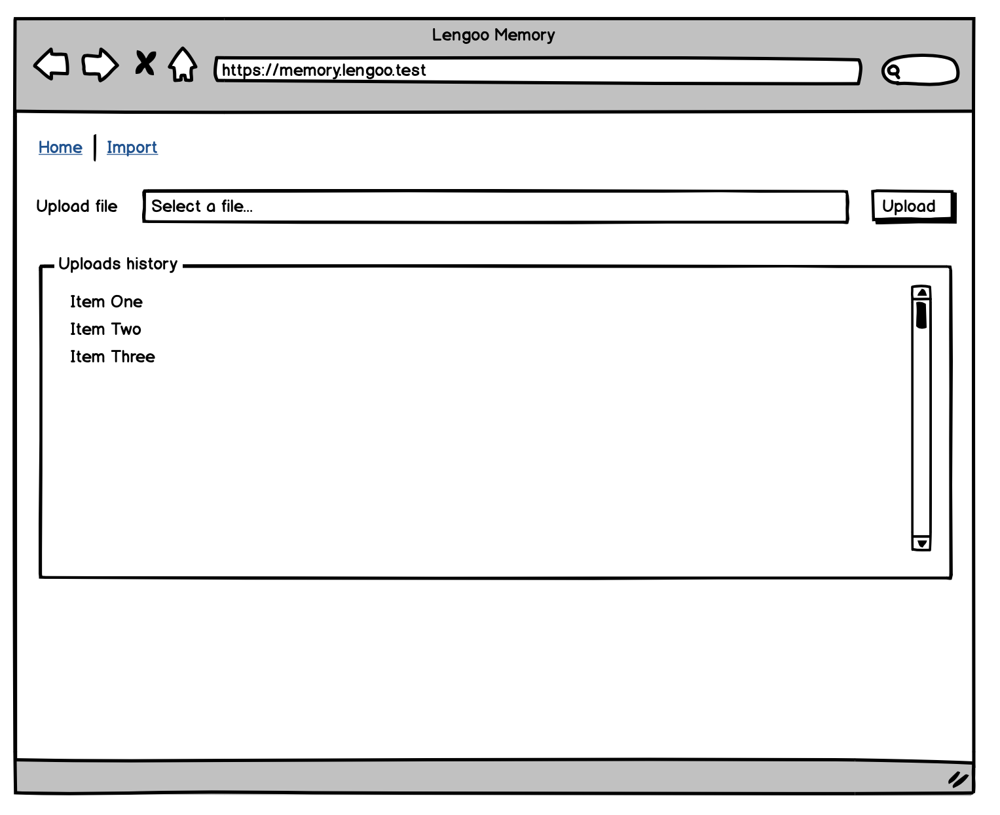

# Coding Challenge 

Hi Adel!

Thanks for taking your time to work on this coding challenge.

Ideally this test should take a day or two. But feel free to take as much time as you need. Quality is more important than speed. Latest delivery though is in one week starting now.

This coding challenge will show us some of your skills. And you get to know our work flow as well. The solution of the challenge is not too hard. So you can focus on technology and code. Show us what you got! :wink:

## Todo:
1. Clone this repo.
2. Create a new `development` branch.
3. Use as many commits as you can so we can see your progress.
4. After finishing your work, create a Pull Request to the master branch.
5. Be ready to answer question.

## Requirements:
 * The task must be developed in NodeJS
 * Use MongoDB as database for ensuring the persistence of the data.
 * Use Elastic search for indexing the data and query over it.
 * Write Unit/Integration tests where applicable/necessary.
 * All code as well as comments and documentation must be in english.
 * In addition to this readme file you will find three folders, `images`, `client` and `server`, feel free to remove images and add your backend codebase to `server` as well as your frontend to `client`.

## Your task:

A Translation Management System (**TMS**) is a tool used for storing past translations and accessing them easily among other functionalities. Your task is to build a simpler version of our TMS.

The backend service will allow:
 
 * Import data in json format by uploading a `translation.json` file to the server, process it and storing the translation units (combination of source segment and target segment) contained. The format of this json will be as follows:

    ```json
    [
      {
        "source": "Hello World",
        "target": "Hola mundo"
      },
      {
        "source": "Hello Everyone",
        "target": "Hola a todos"
      },
      {
        "source": "Hello guys, allow me to introduce the newest team member.",
        "target": "Hola chicos, permítanme presentar al nuevo colega de equipo."
      },
      {
        "source": "A dog was running outside",
        "target": "Un perro corría afuera"
      }
    ]
    ```
  * Query the imported data in a fast way, and retrieve the **closest** results (up to 3), the query can be performed in a bi-directional way, meaning that if the query exists as target in a translation unit inside the system, this will be returned as result, Examples of input and output below:
    
    * Example 1
      ```javascript
      // Input
      {
        query: "Hello",
      }
      // Output
      [
        {
          source: "Hello World",
          target: "Hola mundo"
        },
        {
          source: "Hello Everyone",
          target: "Hola a todos"
        }
      ]
      ```
    * Example 2 (Inverted translation unit where the query is contained in the target instead of the source)

      ```javascript
      // Input
      {
        query: "Un perro",
      }
      // Output
      [{
        source: "A dog was running outside",
        target: "Un perro corría afuera"
      }]
      ```

After finishing with the backend, you are required to develop a simple frontend in VueJS that allows any user to perform the functionalities described before: import data and query the registry.

  * The front page of the application will have two sections:
    
    * Query the memory.
    * See the history for past queries in the session (no need to store this if you refresh the page).
  
  * A second page for importing data, will consist on a file selector to upload the json file that contains the data as well as a history of past files uploaded in the session (no need to store this information if you refresh the page).

Fast prototypes are provided below, no design is needed, means you can use any CSS Framework out there.

**Note:** The application doesn't have to look exactly like the prototypes, these are only intended for giving you an idea of the minimum required sections in the application, creativity is very welcome.

* Home:
  
* Import:
  

## Bonus points:

  * Creativity
  * Clean code
  * Usage of best practices from the Javascript community for both frontend and backend.
  * Application security.
  * Deployment.

## Evaluation Criteria

This is what we look at - among other things:
 
 * The application needs to run. Please provide a **short** readme file containing setup instructions.
 * Testing
 * Usage of `npm` or `yarn`.
 * All code must be formatted and in `utf-8`.
 * Frontend and backend should be able to run standalone.

Good luck :pray:!
